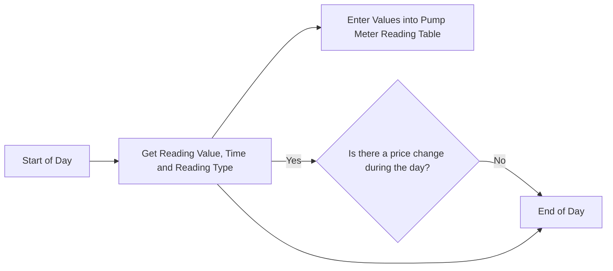
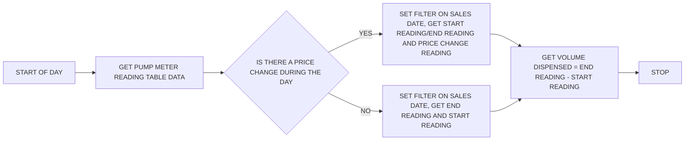

### Pumping Reading Table

| Field | Data Type | Description                           |
| -------- | -------| ------------------------------------- |
| Pump ID (pk)    | Code (10) | Unique Identifier for the pump               |
| Reading Value      |  Decimal    |   Current reading displayed on pump                        |
| Reading Date   |  Date    |    |
| Reading Time | Time |  |
| Reading Type | Option | Start of Day, End of Day, Price Change |

### Daily Pump Sales

| Field             | Data Type   | Description                                                                 |
|------------------|-------------|-----------------------------------------------------------------------------|
| Pump ID (pk)     | Code (10)   | Unique Identifier for the pump                                              |
| Sales Date       | Date        |                                                                             |
| Start Reading    | Decimal     | Start of Day Reading Type from Pump Meter Reading Table                     |
| End Reading      | Decimal     | End of Day Reading Type from Pump Meter Reading Table                       |
| Volume Dispensed | Decimal     | End Reading – Start Reading or Price Change Reading – Start Reading         |

